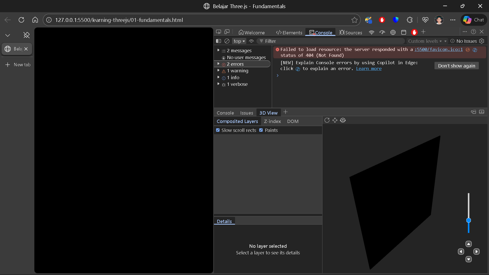
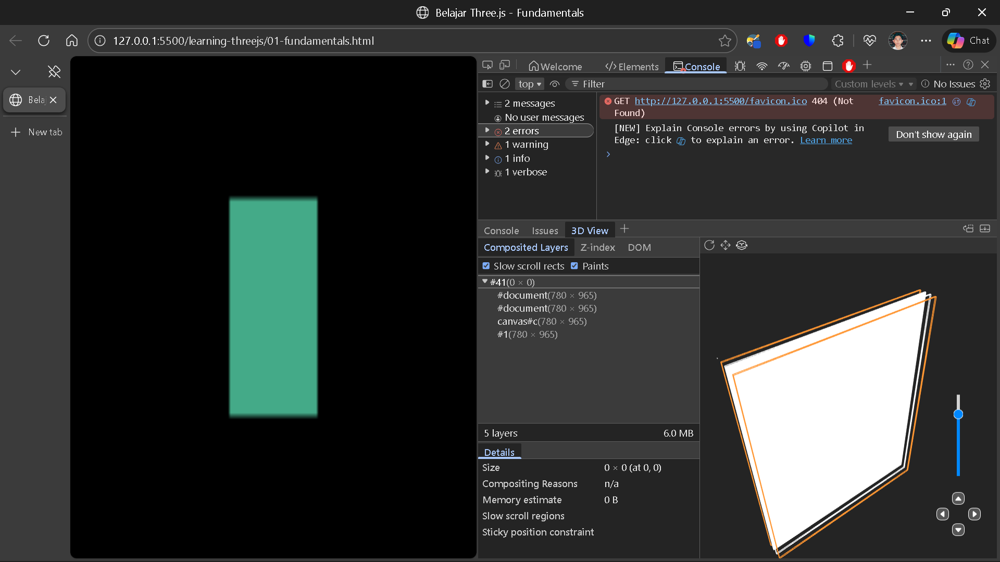
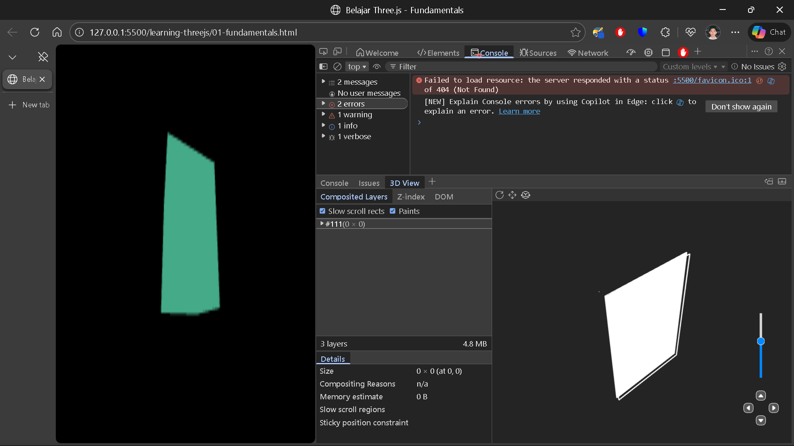
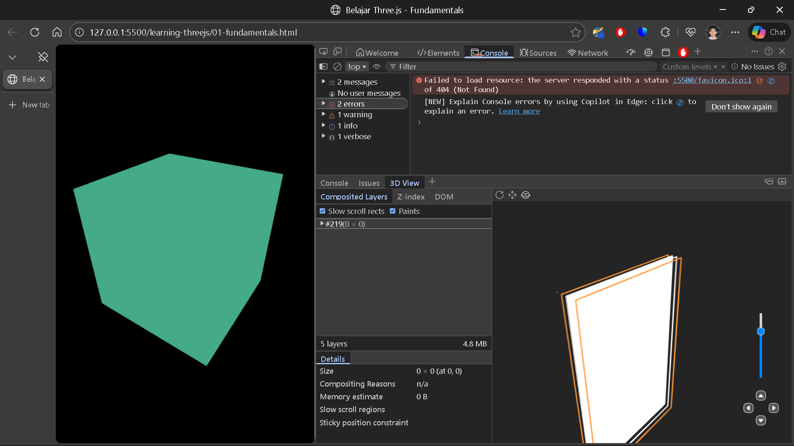
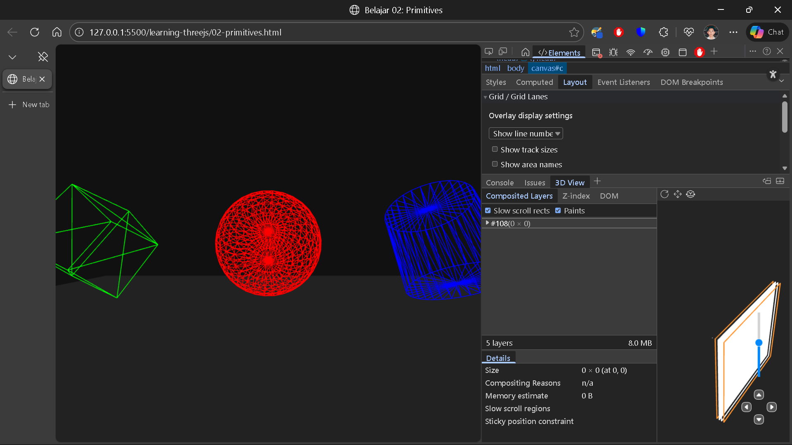
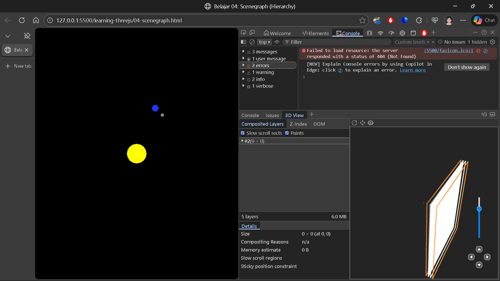
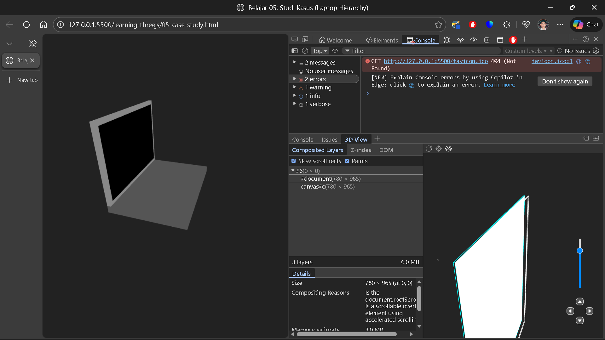

# Roadmap Pembangunan Website Portofolio
Ini adalah roadmap dan checklist untuk membangun website portofolio **teungku-zulkifli.github.io** dari nol.

---

# ✅ Fase 0: Inisialisasi
- [x] Membuat repositori GitHub `teungku-zulkifli.github.io`.
- [x] Menghubungkan repositori lokal dengan Git.

---

# ✅ Fase 1: Fondasi & Struktur Folder 
- [x] Membuat semua struktur folder (`_posts`, `assets`, dan sub-foldernya).
- [x] Membuat file-file kosong (`index.html`, `projects.html`, `blog.html`, `main.style.css`, `main.script.js`).
- [x] Mengunduh `marked.min.js` dan menyimpannya di `assets/js/lib/`.
- [x] Mengisi file `README.md` ini.
- [x] Melakukan commit dan push pertama untuk struktur awal.

---

# ✅ Fase 2: Kerangka HTML
- [x] Membuat kerangka HTML5 dasar untuk `index.html` (termasuk seksi `#home`, `#about`, `#contact`).
- [x] Membuat kerangka HTML5 dasar untuk `projects.html`.
- [x] Membuat kerangka HTML5 dasar untuk `blog.html`.
- [x] Menambahkan semua link CSS dan JS (termasuk logika fallback CDN) di setiap file HTML.
- [x] Membuat 1 file contoh artikel `.md` di dalam `_posts/tutorials/`.

---

# ✅ Fase 3: Styling & Tata Letak
- [x] Mendefinisikan gaya global di `main.style.css` (CSS variables untuk warna, font, dll).
- [x] Mendesain dan menata letak header (navigasi) dan footer.
- [x] Mendesain dan menata letak seksi-seksi di halaman utama (`index.html`).
- [x] Mendesain tampilan galeri proyek (kartu proyek) di `projects.html`.
- [x] Mendesain tampilan daftar artikel di `blog.html`.
- [x] Menerapkan desain responsif (mobile-first) menggunakan media queries.

---

# ✅ Fase 4: Fungsionalitas JavaScript
- [x] Membuat fungsi untuk mengambil dan menampilkan daftar artikel di `blog.html`.
- [x] Membuat fungsi untuk mengambil file `.md`, mem-parsingnya dengan `marked.js`, dan menampilkannya sebagai artikel tunggal.
- [x] Menambahkan fungsionalitas untuk navigasi mobile (hamburger menu).
- [x] Menambahkan fungsionalitas smooth scroll untuk navigasi di `index.html`.

---

# ✅ Fase 5: Pengisian Konten Final
- [x] Mengisi halaman `projects.html` dengan konten proyek yang sebenarnya (gambar, deskripsi, link).
- [x] Menulis 2–3 artikel blog pertama di dalam folder `_posts`.
- [x] Memfinalisasi teks di seksi `#about` dan `#contact`.
- [x] Menambahkan foto profil profesional dan file CV/Resume (PDF).

---

# ⏳ Fase 6: Optimasi & Publikasi Final (Estimasi: Sesi Berikutnya)
- [ ] Mengompres semua gambar untuk mempercepat waktu muat.
- [ ] Memeriksa dan melengkapi tag `<title>` dan `<meta name="description">` untuk SEO dasar.
- [ ] Melakukan pengujian di berbagai browser (cross-browser testing).
- [ ] Memvalidasi kode HTML menggunakan validator W3C.
- [ ] Membagikan link portofolio!

---

# 🧊 Fase 7: Riset & Implementasi 3D (Three.js)
Fase eksperimental untuk menghadirkan pengalaman **Immersive Room** pada portofolio.

### Status Pembelajaran & Prototipe
- [x] **Prototipe Awal:** Membuat konsep ruangan 4 sisi (`vr-room.html`) dengan navigasi mouse dan tekstur placeholder.
- [x] **Setup Lingkungan Belajar:** Membuat folder `learning-threejs/` dan konfigurasi Import Map lokal.

### Kurikulum Three.js
- [x] **Modul 1: The Basics (Fondasi)**  
  - Memahami Trinity (Scene, Camera, Renderer).  
  - Membuat Mesh pertama (Hello Cube).  
  - Implementasi Animation Loop (60 FPS).  
  - Menangani Responsive Design (Resize Event).  
  👉 [Lihat hasil modul 1](https://teungku-zulkifli.github.io/learning-threejs/01-fundamentals.html)
#### Documentation

- [x] **Modul 2: The Object (Benda & Hierarki)**  
  - Eksplorasi Primitives (Sphere, Plane, Cylinder).  
  - Memahami Transformasi (Position, Rotation, Scale).  
  - Memahami Scenegraph (Parenting & Grouping).  
  👉 [Lihat hasil modul 2/1](https://teungku-zulkifli.github.io/learning-threejs/02-primitives.html)
  👉 [Lihat hasil modul 2/2](https://teungku-zulkifli.github.io/learning-threejs/03-transforms.html)
  👉 [Lihat hasil modul 2/3](https://teungku-zulkifli.github.io/learning-threejs/04-scenegraph.html)
  👉 [Lihat hasil modul 2/4](https://teungku-zulkifli.github.io/learning-threejs/05-case-study.html)
#### Documentation

- [ ] **Modul 3: The Look (Tampilan)**  
  - Texture Loading & Mapping.  
  - Pencahayaan (Ambient, Directional, Point Light).  

- [ ] **Modul 4: The Interaction (Interaksi)**  
  - Loading Model 3D Eksternal (GLTF/GLB).  
  - Raycasting (Deteksi klik mouse pada objek 3D).  

### Target Integrasi
- [ ] **Menggabungkan scene 3D final ke `index.html` dengan transisi masuk yang mulus.**
